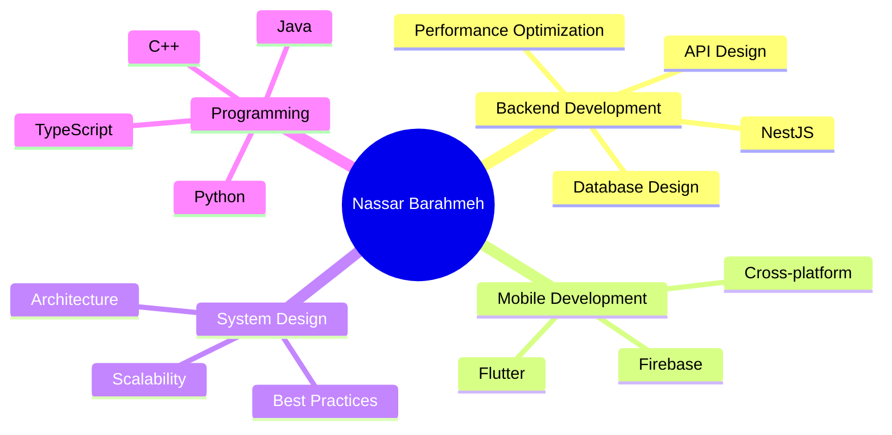

<div align="center">

# 👨‍💻 Nassar Barahmeh

### Full-Stack Engineer | Backend Architect | Mobile Developer

[](https://www.linkedin.com/in/nassar-barahme-378826362)
[](https://github.com/NassarBarahme)
[](mailto:nassarbarahme03@gmail.com)

**🇵🇸 Nablus, Palestine | Building scalable systems, one commit at a time**

</div>

---

## 🎯 About Me

```typescript
const nassar = {
    location: "Nablus, Palestine 🇵🇸",
    role: "Computer Engineer & Backend Specialist",
    passion: ["Backend Architecture", "Mobile Development", "System Design"],
    currentFocus: "Building enterprise-grade APIs with NestJS",
    philosophy: "Clean code is not written by following rules, but by practice",
    workingOn: ["Microservices Architecture", "Cross-platform Mobile Apps", "API Design"],
    learning: ["Cloud Architecture", "DevOps Best Practices", "Distributed Systems"],
    funFact: "I believe every bug is just a feature in disguise 🐛"
};
```

> 💡 *"First, solve the problem. Then, write the code."* - John Johnson

---

## 🚀 Tech Arsenal

### 💻 Backend & Systems Engineering

<div align="center">


</div>

**🔧 Specializations:**
- RESTful API Design & Development
- Microservices Architecture
- Real-time Communication (WebSockets, Socket.io)
- Network Programming & TCP/IP
- Authentication & Authorization (JWT, OAuth)
- Database Design & Optimization

### 🎨 Frontend & Mobile Development

<div align="center">


</div>

### 🗄️ Databases & DevOps

<div align="center">


</div>

**🛠️ Tools & Practices:**
- Database Design & Optimization
- Query Performance Tuning
- Version Control & Git Workflows
- CI/CD Understanding
- Agile Development Methodologies
- Code Reviews & Best Practices

---

## 🏆 Featured Projects

### 🔐 [Task Manager API](https://github.com/NassarBarahme/Task-Manager-Nestjs-)
**Enterprise-grade Task Management Backend**

```
🛠️ Tech Stack: NestJS | PostgreSQL | JWT | TypeORM
```

A production-ready REST API featuring:
- 🔒 Secure JWT-based authentication & authorization
- 📊 Optimized PostgreSQL database with complex relationships
- 🎯 Clean architecture with dependency injection
- 📝 Comprehensive API documentation
- ✅ Input validation & error handling
- 🧪 Following SOLID principles

**Key Achievements:**
- Implemented role-based access control (RBAC)
- Built scalable architecture following best practices
- Applied clean code and maintainable design patterns

---

### 💬 [P2P Chat Network](https://github.com/NassarBarahme/Networks-Project-P2P-Chat)
**Low-Level Network Programming Project**

```
🛠️ Tech Stack: Java | Socket Programming | TCP/IP | Multithreading
```

A high-performance chat application built from scratch:
- 🌐 Custom TCP/IP protocol implementation
- 🔄 Multi-threaded server handling concurrent connections
- 📡 Real-time message broadcasting
- 👥 User presence & status tracking
- 📱 Built without networking frameworks (pure Java sockets)

**Technical Highlights:**
- Handles multiple simultaneous connections
- Low-latency message delivery
- Demonstrates deep understanding of network protocols

---

### 📚 [Study-Mate Mobile App](https://github.com/NassarBarahme/Study-Mate-App-Flutter)
**Mobile-First Productivity Platform**

```
🛠️ Tech Stack: Flutter | Dart | Firebase | REST APIs
```

A comprehensive student productivity app featuring:
- 📅 Smart schedule management
- 📊 Progress tracking & analytics
- 🔔 Intelligent notifications
- 💾 Firebase backend integration
- 🎨 Beautiful, responsive UI
- 🔄 Real-time data synchronization

**Impact:**
- Cross-platform support (iOS & Android)
- Clean and intuitive user interface
- Efficient state management

---

### 🎨 [Image Processing System](https://github.com/NassarBarahme/Image-Project)
**Computer Vision Application**

```
🛠️ Tech Stack: Python | OpenCV | NumPy
```

Advanced image processing application:
- 🖼️ Multiple filter implementations
- 🔄 Image transformations
- 📐 Edge detection algorithms
- 🎯 Custom image processing pipeline
- 📊 Real-time processing capabilities

**Features:**
- Efficient algorithm implementation
- Support for various image formats
- Optimized performance

---

## 📊 GitHub Analytics

<div align="center">


</div>

<div align="center">

[](https://git.io/streak-stats)

</div>

<div align="center">


</div>

---

## 💼 Professional Experience

### 🎯 Core Competencies



### 📈 Contribution Graph

<div align="center">


</div>

---

## 🌟 What I Bring to the Table

<table>
<tr>
<td width="50%">

### 🎯 Technical Excellence
- Clean, maintainable code
- SOLID principles advocate
- Performance optimization
- Security best practices
- Scalable architecture

</td>
<td width="50%">

### 🤝 Collaboration
- Clear communication
- Code reviews
- Technical documentation
- Team player mindset
- Continuous learning

</td>
</tr>
</table>

---

## 📚 Current Learning Journey

```javascript
const learningPath2025 = {
    reading: [
        "System Design Interview by Alex Xu",
        "Clean Architecture by Robert C. Martin",
        "Designing Data-Intensive Applications"
    ],
    exploring: [
        "Microservices Architecture",
        "Cloud Architecture (AWS/Azure)",
        "DevOps & CI/CD Pipelines",
        "Advanced Flutter Patterns"
    ],
    building: [
        "Scalable backend systems",
        "Real-time applications",
        "Cross-platform mobile apps"
    ]
};
```

---

## 🤝 Let's Connect & Collaborate

<div align="center">

### 💬 Open to opportunities in:
**Backend Engineering** • **Full-Stack Development** • **Mobile Development** • **System Architecture**

### 📧 Reach Out

[](https://www.linkedin.com/in/nassar-barahme-378826362)
[](https://github.com/NassarBarahme)
[](mailto:nassarbarahme03@gmail.com)

</div>

---

<div align="center">

### 💭 Developer Wisdom

*"Code is like humor. When you have to explain it, it's bad."* - Cory House

*"Any fool can write code that a computer can understand. Good programmers write code that humans can understand."* - Martin Fowler

*"The best thing about a boolean is even if you are wrong, you are only off by a bit."* - Anonymous

---

### ⚡ Fun Facts About Me

☕ Coffee-driven developer | 🌙 Night owl programmer | 📚 Always learning  
🏗️ Building side projects | 🎯 Problem solver at heart | 🇵🇸 Proud Palestinian

---


**💙 Thanks for visiting! Let's build something amazing together!**

</div>

---

<div align="center">
<i>⭐️ From <a href="https://github.com/NassarBarahme">NassarBarahme</a> with passion and dedication</i>
</div>
